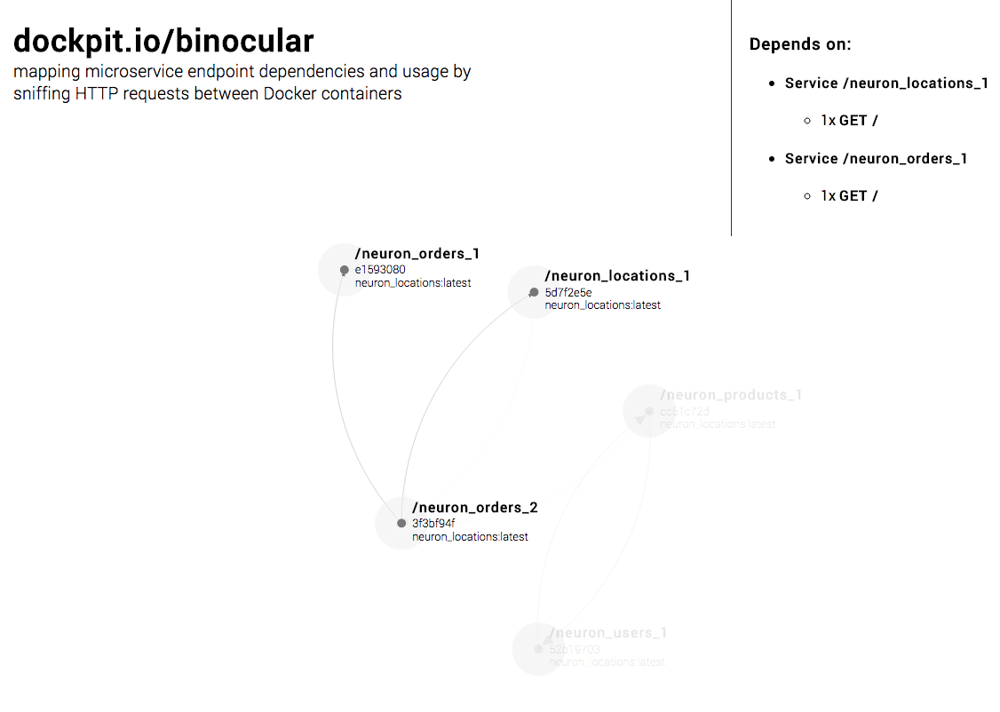

# Dockpit Binocular
_NOTE: This is our submission for the Docker Global Hack Day, as such it is based on several terrible hacks and should not be used in production._

Docker is an awesome tool for creating [microservice](http://martinfowler.com/articles/microservices.html) architectures. But as the number of services increases and responsibility for them spreads amongst different team members, dependencies become harder and harder to manage. 

Binocular aims to be a simple plug-and-play solution that maps services and their dependencies by sniffing and logging _real_ http traffic between containers over the host network interface (docker0). In doing so it is capable of inspecting HTTP headers and determine what exact endpoint are used by what service and how often. 

A simple web page is exposed that draws a standard 'force directed' graph based on the logged HTTP requests:



Advantages:
- By having an always up-to-date overview of dependencies and their versions (through the used docker image) it becomes easier to communicate breaking changes to the correct team members. 
- Dependencies between micorservice should be reduced to the bare minimun, Binocular aims to better inform software developers about the dependencies they create.
- _As A Bonus:_ It provides visual feedback on how often a certain endpoint is used, this helps focus optimization effort to specific endpoints.


### Run on Boot2Docker:
In order to run the container requires the environment variable DOCKER\_HOST and DOCKER\_CERT\_PATH to be set. The first one should point to the Docker host from inside the container and the second should point to the directory that contains the  certificates, which you should probably mount from the host.

For sniffing, the container requires access to the host's network stack, and thus should be started with `--net=host`. 

Putting this all together, you can one-line run the container on boot2docker as follows: 
```
docker run --net=host -it -e DOCKER_HOST=tcp://`boot2docker ip`:2376 -e DOCKER_CERT_PATH=/cert -v /home/docker/.docker:/cert binocular
```

### Building
Building the container is straight forward, taggig it 'binocular' is not mandatory but ofcourse make sure you adjust your run command accordingly.

`docker build -t binocular .`